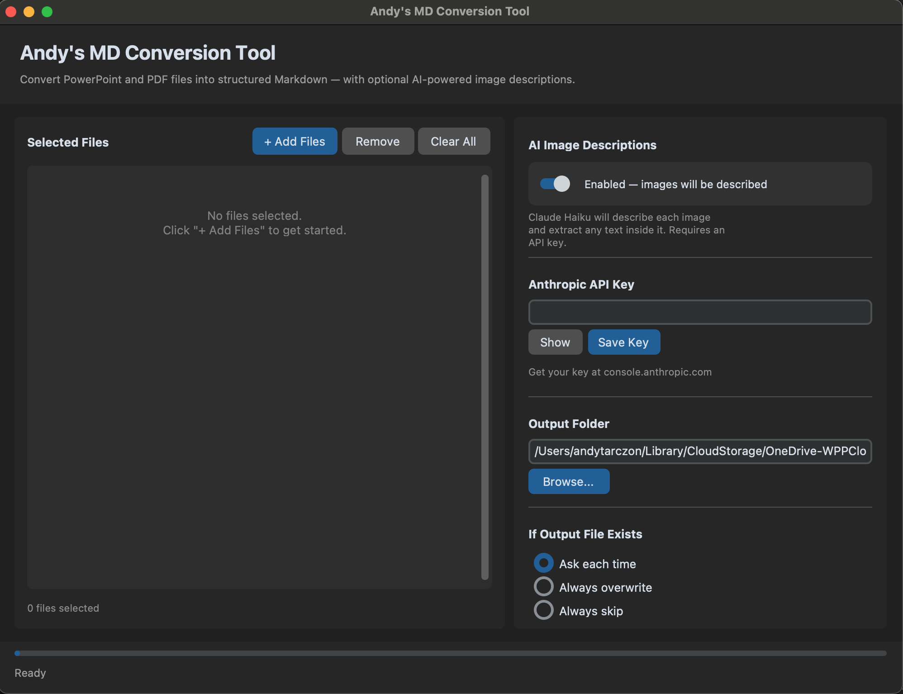

# Andy's MD Conversion Tool

A macOS desktop app that converts PowerPoint (`.pptx`) and PDF files into clean, structured Markdown — with optional AI-powered image descriptions using Claude.

---

## Features

- **Convert PPTX & PDF → Markdown** — preserves document title, slide/page numbers, headings, bullet points, tables, and speaker notes
- **AI image descriptions** — uses Claude Haiku (Anthropic's vision model) to describe images, extract text from images, and summarize charts and diagrams
- **Cost estimation** — shows image count and estimated API cost before processing
- **Secure API key storage** — key is saved to Mac Keychain, never stored in plain text
- **Polished desktop GUI** — built with CustomTkinter; no Terminal required to run
- **Batch conversion** — select multiple files at once
- **Flexible output** — choose your output folder; handles existing files (overwrite / skip / ask)
- **Image descriptions optional** — toggle off to convert text-only with no API key needed

---

## Screenshots

### Welcome Screen


### Main App


---

## Requirements

- macOS (tested on macOS 13+)
- Python 3.10+
- An [Anthropic API key](https://console.anthropic.com) *(only required for image descriptions)*

---

## Installation

### Option 1 — Run from source

```bash
# Clone the repo
git clone https://github.com/YOUR_USERNAME/andys-md-conversion-tool.git
cd andys-md-conversion-tool

# Create and activate a virtual environment
python3 -m venv .venv
source .venv/bin/activate

# Install dependencies
pip install -r requirements.txt

# Launch the app
python app.py
```

### Option 2 — Double-click launcher

```bash
# Make the launcher executable (first time only)
chmod +x "Andy's MD Conversion Tool.command"
```

Then double-click **`Andy's MD Conversion Tool.command`** in Finder. It will set up the virtual environment and launch the app automatically.

---

## Usage

1. Open the app
2. On first launch, choose whether to enable AI image descriptions
3. Click **+ Add Files** and select your `.pptx` or `.pdf` files
4. Choose an **Output Folder**
5. Click **Analyze Files** to see image count and estimated cost
6. Click **Convert to Markdown**

### API Key Setup

Image descriptions require an Anthropic API key:

1. Get a free key at [console.anthropic.com → API Keys](https://console.anthropic.com)
2. Paste it into the **Anthropic API Key** field
3. Click **Save Key** — it's stored securely in your Mac Keychain

Each user needs their own key. Cost is typically fractions of a cent per image using Claude Haiku.

---

## Output Format

Each converted file produces a `.md` file like this:

```markdown
# Document Title
*Source: filename.pptx*
---

## Slide 1: Introduction

Bullet point one
- Sub-bullet

## Slide 2: Data Overview

> **[Image]** Bar chart showing Q4 revenue by region. North: $82M, 
> South: $65M, East: $91M, West: $74M.
```

---

## Project Structure

```
.
├── app.py                              # GUI layer (CustomTkinter)
├── converter.py                        # Conversion logic + Claude API
├── requirements.txt                    # Python dependencies
├── Andy's MD Conversion Tool.command   # Double-click Mac launcher
└── Andy's MD Conversion Tool - Full Build.ipynb   # Annotated build walkthrough
```

---

## Tech Stack

| Library | Purpose |
|---|---|
| `customtkinter` | Desktop GUI |
| `python-pptx` | Read PowerPoint files |
| `PyMuPDF` | Read PDF files and extract images |
| `anthropic` | Claude Haiku vision API |
| `keyring` | Mac Keychain for secure key storage |
| `Pillow` | Image processing |

---

## Building a Distributable .app

To package as a standalone Mac app (no Python install required):

```bash
pip install pyinstaller
pyinstaller \
  --name "AndysMDConversionTool" \
  --windowed \
  --onedir \
  --collect-all customtkinter \
  --collect-all anthropic \
  --collect-all keyring \
  app.py
```

To create a `.dmg` installer:

```bash
brew install create-dmg
create-dmg \
  --volname "Andy's MD Conversion Tool" \
  --window-size 600 400 \
  --app-drop-link 450 185 \
  "Andy's MD Conversion Tool.dmg" \
  "dist/AndysMDConversionTool.app"
```

---

## Notebook

`Andy's MD Conversion Tool - Full Build.ipynb` is a fully annotated walkthrough of the entire codebase — written for beginners. It covers:

- Reading PPTX and PDF files with Python
- Calling the Claude vision API for image descriptions
- Cost estimation
- The complete `FileConverter` class
- GUI architecture overview
- Packaging and distribution

All logic cells are runnable in Jupyter or Google Colab.

---

## License

MIT — free to use, modify, and distribute.

---

*Built with Python + Claude. First desktop app project.*
